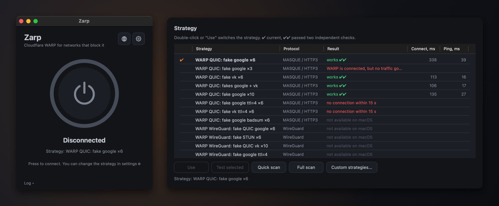
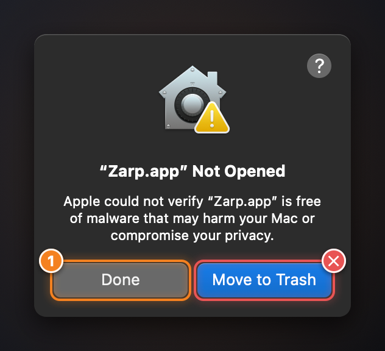
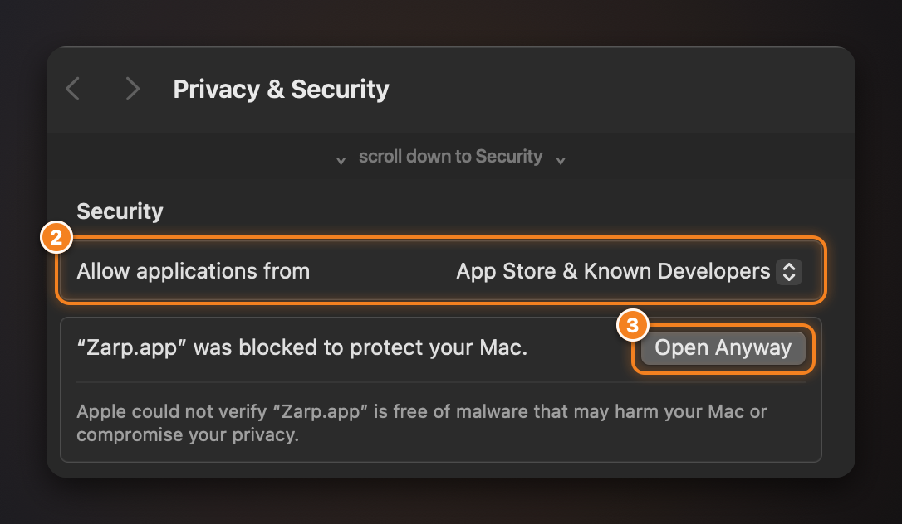

# Zarp for macOS

[](https://github.com/feg55/Zarp-MacOS/actions/workflows/ci.yml)
[](https://github.com/feg55/Zarp-MacOS/releases/latest)
[](LICENSE)

One-click Cloudflare WARP for networks that block it. Zarp finds a [zapret2](https://github.com/bol-van/zapret2) strategy that gets the WARP handshake through DPI, remembers it and connects. The macOS version of [Zarp for Windows](https://github.com/feg55/Zarp) and [Zarp for Android](https://github.com/feg55/Zarp-Android), a native app for Apple Silicon.

> [!NOTE]
> **Zarp won't open?** The release is not notarized by Apple, so macOS blocks the first launch. [Why won't Zarp open?](#why-wont-zarp-open) shows the three clicks, with screenshots.



## Download

| Platform | Download | Requirements |
|---|---|---|
| **macOS** | [**DMG**](https://github.com/feg55/Zarp-MacOS/releases/latest) · [all releases](https://github.com/feg55/Zarp-MacOS/releases) | Apple Silicon Mac (M1 or newer), macOS 14 or later (tested on 15), an administrator password once. No WARP app needed: Zarp is its own WARP client |
| **Windows** | [**Zarp.exe**](https://github.com/feg55/Zarp/releases/latest/download/Zarp.exe) · [all releases](https://github.com/feg55/Zarp/releases) | Windows 10/11 x64, administrator rights. [Cloudflare WARP](https://one.one.one.one/) is installed by Zarp if it is missing |
| **Android** | [**APK**](https://github.com/feg55/Zarp-Android/releases/latest) · [source](https://github.com/feg55/Zarp-Android) | Android 8.0+, no root, no WARP app needed |

## Features

- **One button.** The first press searches for the fastest working strategy, later presses connect right away.
- **Its own WARP client.** Zarp registers a free anonymous WARP account (after you accept Cloudflare's terms) and speaks MASQUE to Cloudflare itself, over HTTP/3 or HTTP/2. No `warp-cli`, no official app.
- **The whole Mac.** While it says *Connected*, all traffic (IPv4 and IPv6) and DNS go through WARP. The routes disappear with the tunnel, so even a crashed daemon leaves your network working.
- **Honest testing.** Each test runs on a fresh WARP endpoint and every candidate is checked twice. A strategy passes only if `cdn-cgi/trace` reports `warp=on`.
- **Self-healing.** If the saved strategy stops working, Zarp tries the other verified ones before searching again, and it reconnects by itself when the connection drops.
- **The same strategies as Windows and Android.** Eleven of the 20 run on macOS; those that need raw sockets or WireGuard are shown as unavailable, with the reason.
- **Your language.** English, Русский, Español, Português, 中文, हिन्दी, Français and Deutsch. Zarp follows the macOS language (English if it is not on the list), and the globe button switches it on the fly.

## Usage

### First launch

1. Open the disk image, drag **Zarp** to **Applications** and eject the image. Run Zarp from Applications, not from the image or Downloads: the background service only installs from there.
2. Open Zarp. macOS blocks the first launch; allow it once in **System Settings > Privacy & Security > Open Anyway** ([screenshots below](#why-wont-zarp-open)).
3. Click the gear icon, find the **zarpd daemon** section and click **Install**. macOS shows a "background item added" notification: open **System Settings > General > Login Items & Extensions** and switch Zarp on under *Allow in the Background*. This is needed once.
4. Turn off any other VPN, then press the power button. The first time, Zarp asks to create a free anonymous WARP account for this Mac and accept Cloudflare's terms on your behalf, then searches for a strategy and connects. The first search takes a minute or two.

Settings offer two searches. **Quick scan** (also used by the power button) stops after 3 working strategies; the number is adjustable. **Full scan** tests every strategy: slower, but nothing is skipped, so it finds the fastest one for sure. Settings also has switches for *Route all traffic through WARP* and *Use Cloudflare DNS*.

Closing the window asks whether to hide Zarp in the menu bar or quit. Select **Remember my choice** to make that action the default; Settings > **On close** changes it later. Quitting disconnects WARP unless you turn off *Disconnect WARP on exit*.

> [!NOTE]
> Turn off any other VPN (Happ, v2rayN, Clash, AmneziaVPN, ...) and Cloudflare's own WARP app before connecting. WARP traffic would go through that tunnel instead, and Zarp could not build its own. Zarp warns you when it sees one.

### Why won't Zarp open?

The release is not notarized by Apple (there is no paid Apple Developer membership behind this free project), so the first time you open Zarp macOS says it could not verify the app. Nothing is wrong with the download; you only have to allow it once.

**1. Close the warning with Done.**

<p align="center">
  
</p>

> [!WARNING]
> Click **Done**, not the blue **Move to Trash** button: that would delete Zarp.

**2. Open System Settings > Privacy & Security** and scroll down to **Security**. Leave **Allow applications from** on **App Store & Known Developers**, the default (on macOS 14 it reads *App Store and identified developers*).

**3. Click Open Anyway** next to *"Zarp" was blocked to protect your Mac* and confirm with Touch ID or your password. If macOS asks once more, choose **Open**. Zarp starts, and macOS remembers your choice for this copy of the app.

<p align="center">
  
</p>

No *Open Anyway* button? It shows for about an hour after the failed launch: open Zarp once more and look again. Zarp also has to be in **Applications**. On macOS 14 and earlier, Control-click on Zarp > **Open** works too (Apple removed that shortcut in macOS 15). Still blocked, or macOS says Zarp is "damaged"? Remove the download flag, then open Zarp again:

```sh
xattr -dr com.apple.quarantine /Applications/Zarp.app
```

Every new download (an update, for instance) is checked again, so you repeat this once for it. More help: [docs/TROUBLESHOOTING.md](docs/TROUBLESHOOTING.md).

### Verify the download

The release notes list the SHA-256 of the disk image:

```sh
shasum -a 256 ~/Downloads/Zarp-*.dmg      # compare with the release notes
```

### What Zarp changes on your system

- **A background service.** *Install* registers a root LaunchDaemon (`io.github.zarp.mac.zarpd`). It is the only part with elevated rights and the only part that touches the network configuration, and it does nothing until the app asks. The app itself runs as you.
- **While connected:** a `utun` interface, routes that send all IPv4 and IPv6 traffic through it (your real default route is not modified), one host route that keeps Zarp's own connection to Cloudflare off the tunnel, and the DNS of your active network service pointed at Cloudflare. Disconnecting removes all of it and restores your DNS exactly as it was.
- **Files:** settings and results in `~/Library/Application Support/Zarp`, logs in `~/Library/Logs/Zarp`, the WARP account (root-only) in `/Library/Application Support/Zarp`. The full list is in [docs/ARCHITECTURE.md](docs/ARCHITECTURE.md#9-data-logs-and-privacy).
- Only if you turn it on: **Start with macOS** adds Zarp to your login items.

### Uninstall

1. In Settings, turn off **Start with macOS** (if it is on) and disconnect.
2. Settings > zarpd daemon > **Uninstall**, then quit Zarp and delete `/Applications/Zarp.app`.
3. Optionally delete the data. This removes the WARP account too, so the next install registers a new one:

   ```sh
   rm -rf ~/Library/Application\ Support/Zarp ~/Library/Logs/Zarp
   sudo rm -rf "/Library/Application Support/Zarp" /Library/Logs/Zarp /Library/Logs/zarpd.log /var/db/zarpd
   ```

### Privacy

Zarp has no telemetry and sends nothing to its author. It makes only these network requests:

- the one-time anonymous **WARP registration** with Cloudflare, after you accept Cloudflare's terms (no personal information is sent);
- the **WARP tunnel** itself, to Cloudflare's WARP addresses;
- `https://1.1.1.1/cdn-cgi/trace`, through the tunnel, while testing and connecting, to check that traffic goes through WARP and to measure latency.

WARP is a Cloudflare service covered by the [Cloudflare WARP privacy policy](https://www.cloudflare.com/application/privacypolicy/).

## How it works

A strategy is a WARP transport (MASQUE over HTTP/3 or HTTP/2) plus a zapret2 profile. Before the real handshake, Zarp's background service sends a few decoy packets from the same UDP socket, so DPI classifies the flow as harmless and Cloudflare ignores the decoys; over HTTP/2 it splits the TLS ClientHello instead. A search tests each strategy on its own tunnel and endpoint and fetches `cdn-cgi/trace` through it. Score is `connect time + 4 × ping`, the same as on Windows and Android. The decoys are real captures from zapret2. The design, the security model and the failure behaviour are in [docs/ARCHITECTURE.md](docs/ARCHITECTURE.md).

Your own strategies go into `strategies.txt` (*Custom strategies...* in Settings), in the same format as on Windows:

```
# name | transport (h3, h2, wg) | zapret2 profile args
My QUIC | h3 | --payload=quic_initial --lua-desync=fake:blob=quic_google:repeats=8
```

Zarp supports plain fake packets (with `ip_ttl`, `ip6_ttl`, `repeats`) for `h3` and `multisplit` / `multidisorder` for `h2`; anything else, including every `wg` line, is listed as unavailable. See the [zapret2 manual](https://github.com/bol-van/zapret2/blob/master/docs/manual.en.md) for `--lua-desync` syntax.

## Building

Needs Xcode 16 or later, Go (the version in [`zarpd/go.mod`](zarpd/go.mod)) and [XcodeGen](https://github.com/yonaskolb/XcodeGen).

```sh
brew install go xcodegen
make test       # Go (vet, race detector) and Swift tests; no root, no network
make dmg        # a signed disk image; needs your Apple Development team
```

Installing the background service needs a signed app. Signing with your own team, running the daemon by hand and the real-network test (`scripts/test-integration.sh`) are in [docs/DEVELOPMENT.md](docs/DEVELOPMENT.md); releases are built locally, see [docs/RELEASING.md](docs/RELEASING.md). GitHub Actions builds and tests every push.

Bug reports, strategy results from your network and translations are welcome: see [CONTRIBUTING.md](CONTRIBUTING.md). Please report security problems privately: [SECURITY.md](SECURITY.md).

### Translations

All UI strings live in [`Resources/Lang`](Resources/Lang), one `key = value` file per language, with `en.txt` as the reference. To fix a translation, edit the file. To add a language, copy `en.txt` to `<code>.txt`, translate the values and add the code to `Localization.languages` ([details](CONTRIBUTING.md#translations)). The tests check that every language has the same keys and placeholders as English.

## License

MIT, see [LICENSE](LICENSE). Zarp for Windows is MIT too; [Zarp for Android](https://github.com/feg55/Zarp-Android) is GPL-3.0 and was studied as a design reference, not copied ([details](docs/ARCHITECTURE.md#11-licensing-and-provenance)).

Bundled components: [usque](https://github.com/Diniboy1123/usque), [connect-ip-go](https://github.com/Diniboy1123/connect-ip-go), [quic-go](https://github.com/quic-go/quic-go) and the `tun` package of [wireguard-go](https://git.zx2c4.com/wireguard-go), all under permissive licenses, plus the fake packets from [zapret2](https://github.com/bol-van/zapret2) (MIT). License texts are in [`Resources/Licenses`](Resources/Licenses/THIRD_PARTY_NOTICES.md), also reachable from Settings > Licenses.

Cloudflare and WARP are trademarks of Cloudflare, Inc. Zarp is an independent project, not affiliated with or endorsed by Cloudflare.
