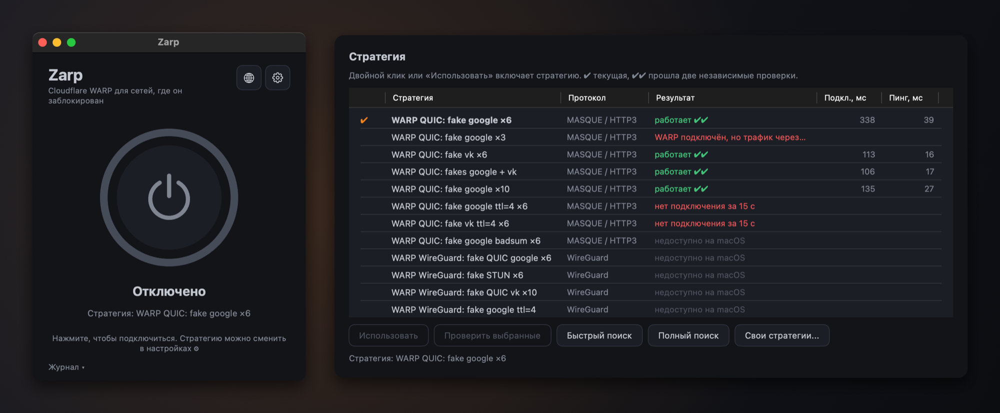

<p align="center">
  
</p>

<h1 align="center">Zarp для macOS</h1>

<p align="center">
  Cloudflare WARP в один клик там, где его блокируют.<br>
  Нативное приложение для Apple Silicon. Открытый код, без телеметрии.
</p>

<p align="center">
  <a href="https://github.com/feg55/Zarp-MacOS/actions/workflows/ci.yml"></a>
  <a href="https://github.com/feg55/Zarp-MacOS/releases/latest"></a>
  <a href="LICENSE"></a>
  
  
</p>

<p align="center">
  <a href="README.md">English</a> · <b>Русский</b>
</p>

Zarp подбирает стратегию в духе [zapret2](https://github.com/bol-van/zapret2), с которой рукопожатие
Cloudflare WARP проходит через DPI вашей сети, запоминает её и подключается. Первое нажатие кнопки ищет
стратегию, все следующие подключают сразу.

<p align="center">
  
</p>

Zarp для macOS — часть семейства: [Zarp для Windows](https://github.com/feg55/Zarp) и
[Zarp для Android](https://github.com/feg55/Zarp-Android) используют те же стратегии и тот же сценарий в одно
касание.

## Скачать

Возьмите последний `Zarp-<версия>-arm64.dmg` на странице **[Releases](https://github.com/feg55/Zarp-MacOS/releases/latest)**.

| | |
|---|---|
| **Mac** | Apple Silicon (M1 или новее) |
| **macOS** | 14 Sonoma или новее. Разрабатывалось и проверялось на macOS 15; на 14 должно работать, но не проверялось |
| **Права** | Пароль администратора, один раз, чтобы установить фоновую службу |
| **Другое ПО** | Не нужно. Zarp сам является клиентом WARP: приложение Cloudflare ставить не надо |

> [!IMPORTANT]
> Релиз **не нотаризован Apple** (у проекта нет платного членства Apple Developer), поэтому macOS блокирует
> первый запуск. Это ожидаемо; [шаги ниже](#первый-запуск) займут минуту. Сначала сверьте скачанный файл с
> SHA-256 из описания релиза ([как](#проверка-загрузки)).

## Возможности

- **Одна кнопка.** Первое нажатие ищет самую быструю стратегию, которая работает в вашей сети (быстрый поиск
  останавливается, когда найдено три рабочих); дальше подключение происходит сразу.
- **Настоящий клиент WARP.** Zarp сам регистрирует бесплатный анонимный аккаунт WARP (после того как вы
  принимаете условия Cloudflare) и говорит с Cloudflare по MASQUE напрямую, по HTTP/3 или HTTP/2. Ни `warp-cli`,
  ни официального приложения.
- **Туннель для всего Mac.** Пока написано «Подключено», весь трафик Mac, IPv4 и IPv6, и его DNS идут через
  WARP. Переключатель в настройках ограничивает туннель тестовым маршрутом, если нужно просто поэкспериментировать.
- **Честная проверка.** Каждый тест идёт через новый endpoint WARP, а двойную галочку (✔✔) стратегия получает,
  только пройдя второй, независимый тест.
- **Самолечение.** Если сохранённая стратегия перестала работать, Zarp пробует другие проверенные, прежде чем
  искать заново, и сам переподключается при обрыве.
- **Безопасный отказ.** Добавленные маршруты исчезают вместе с туннелем, поэтому даже упавшая служба оставляет
  сеть рабочей; всё, что могло бы пережить сбой (DNS, один хост-маршрут), записывается в журнал и убирается при
  следующем запуске. Скрипт проверки на реальной сети доказывает это, включая `kill -9`.
- **Одиннадцать рабочих стратегий** из 20 в каталоге (поддельные QUIC-пакеты, разбиение TLS и disorder, две
  прямые «контрольные»), плюс ваши собственные в `strategies.txt`. Остальным нужны raw-сокеты или WireGuard;
  они показаны как недоступные, с причиной.
- **Нативное и небольшое.** Приложение на SwiftUI, значок в строке меню, восемь языков: English, Русский,
  Español, Português, 中文, हिन्दी, Français, Deutsch.

## Первый запуск

1. Откройте образ диска и перетащите **Zarp** на ярлык **Applications** («Программы»), затем извлеките образ.
   Запускайте Zarp из «Программ», а не из образа и не из «Загрузок» (фоновая служба устанавливается только оттуда).
2. Откройте Zarp. macOS сообщит, что не может проверить разработчика. Откройте **Системные настройки >
   Конфиденциальность и безопасность**, прокрутите до раздела *Безопасность*, нажмите **Всё равно открыть** рядом
   с сообщением о блокировке Zarp и подтвердите паролем или Touch ID. Если кнопки нет, блокировку снимает команда
   в Терминале: `xattr -dr com.apple.quarantine /Applications/Zarp.app`
3. Нажмите значок шестерёнки, найдите раздел **Служба zarpd** и нажмите **Установить**. macOS покажет
   уведомление о добавлении фонового объекта: откройте **Системные настройки > Основные > Объекты входа и
   расширения** и включите Zarp в разделе *Разрешить в фоновом режиме*. Это нужно сделать один раз.
4. **Выключите другой VPN** (и приложение Cloudflare WARP) и нажмите кнопку питания. В первый раз Zarp предложит
   создать бесплатный анонимный аккаунт WARP для этого Mac и от вашего имени принять условия Cloudflare. Затем он
   подберёт стратегию и подключится.

Что-то пошло не так? Смотрите [docs/TROUBLESHOOTING.md](docs/TROUBLESHOOTING.md) (на английском).

### Проверка загрузки

В описании релиза указан SHA-256 образа диска:

```sh
shasum -a 256 ~/Downloads/Zarp-0.1.0-arm64.dmg      # сравните с описанием релиза
```

## Как пользоваться

- **Подключить / отключить:** большая кнопка или значок в строке меню. Строка состояния показывает, что делает Zarp.
- **Стратегии:** в настройках они перечислены с результатами. *Быстрый поиск* останавливается после выбранного
  числа рабочих стратегий; *Полный поиск* проверяет все: дольше, зато ничего не пропускается. *Проверить
  выбранные* пробует отмеченную; *Использовать* переключается на неё. Стратегия с ✔✔ прошла две независимые проверки.
- **Свои стратегии:** *Свои стратегии...* открывает `strategies.txt` в папке данных. Одна стратегия на строку:

  ```
  # имя | транспорт (h3, h2, wg) | аргументы профиля zapret2
  My QUIC | h3 | --payload=quic_initial --lua-desync=fake:blob=quic_google:repeats=8
  ```

  Синтаксис — `--lua-desync` из zapret2; Zarp поддерживает простые поддельные пакеты (с `ip_ttl`, `ip6_ttl`,
  `repeats`) для `h3` и `multisplit` / `multidisorder` для `h2`. Всё остальное, включая любую строку `wg`,
  отображается как недоступное, с причиной.
- **Закрытие окна** спрашивает, свернуть Zarp в строку меню или выйти; в настройках есть выбор *При закрытии*.
  Выход отключает WARP, если не выключить *Отключать WARP при выходе*.

## Что Zarp меняет в системе

- **Фоновая служба.** Когда вы нажимаете *Установить*, в macOS регистрируется LaunchDaemon с правами root
  (`io.github.zarp.mac.zarpd`). Это единственная часть с повышенными правами и единственная, которая меняет
  сетевую конфигурацию; само приложение работает от вашего имени. Пока приложение ничего не просит, служба
  ничего не делает.
- **Пока подключено:** интерфейс `utun`, два маршрута, покрывающие всё адресное пространство IPv4 (и два для
  IPv6) через него, один хост-маршрут, который удерживает собственное соединение Zarp с Cloudflare вне туннеля,
  и DNS активного сетевого сервиса, направленный на резолверы Cloudflare. Ваш настоящий маршрут по умолчанию не
  меняется. При отключении всё это убирается, а DNS возвращается ровно таким, каким был.
- **Файлы:** настройки и результаты — в `~/Library/Application Support/Zarp`, журналы — в `~/Library/Logs/Zarp`,
  аккаунт WARP службы (только для root) — в `/Library/Application Support/Zarp`. Полный список:
  [docs/ARCHITECTURE.md](docs/ARCHITECTURE.md#9-data-logs-and-privacy).
- **Только если вы включите:** *Запускать вместе с macOS* добавляет Zarp в объекты входа.

### Удаление

1. В настройках выключите *Запускать вместе с macOS* (если включено) и отключитесь.
2. Настройки > Служба zarpd > **Удалить**, затем завершите Zarp и удалите `/Applications/Zarp.app`.
3. По желанию удалите данные (вторая строка удаляет аккаунт WARP, при следующей установке будет создан новый):

   ```sh
   rm -rf ~/Library/Application\ Support/Zarp ~/Library/Logs/Zarp
   sudo rm -rf "/Library/Application Support/Zarp" /Library/Logs/Zarp /Library/Logs/zarpd.log /var/db/zarpd
   ```

## Приватность

В Zarp нет телеметрии, автору ничего не отправляется. Приложение делает ровно такие сетевые запросы:

- единоразовая анонимная **регистрация WARP** в Cloudflare, после того как вы приняли условия Cloudflare
  (личные данные не передаются);
- сам **туннель WARP** к адресам WARP Cloudflare — ради этого приложение и существует;
- **`https://1.1.1.1/cdn-cgi/trace`** через туннель, при проверке и подключении, чтобы убедиться, что трафик
  действительно идёт через WARP, и измерить задержку.

WARP — сервис Cloudflare, на него распространяются
[условия и политика конфиденциальности Cloudflare](https://www.cloudflare.com/application/privacypolicy/).
Использование WARP, в том числе в вашей стране, — ваша ответственность.

## Как это работает

Сети, блокирующие WARP, обычно узнают первый пакет его рукопожатия (QUIC Initial, отправленный на адрес WARP).
Служба Zarp перед настоящим рукопожатием отправляет с того же сокета несколько пакетов-обманок, так что DPI
считает поток безобидным, а Cloudflare обманки игнорирует; для транспорта HTTP/2 вместо этого TLS ClientHello
разбивается на несколько TCP-сегментов. Затем Zarp перебирает стратегии, пока одна не заработает в вашей сети,
подтверждает её на втором endpoint, запоминает и пропускает ваши пакеты через получившийся MASQUE-туннель.

Устройство, модель безопасности и поведение при сбоях описаны в [docs/ARCHITECTURE.md](docs/ARCHITECTURE.md)
(на английском).

## Сборка из исходников

Нужны Xcode 16 или новее, Go (версия из [`zarpd/go.mod`](zarpd/go.mod)) и
[XcodeGen](https://github.com/yonaskolb/XcodeGen) (`brew install go xcodegen`).

```sh
make test       # тесты Go (vet, детектор гонок) и Swift: root и сеть не нужны
make build      # неподписанная Release-сборка, та же проверка, что в CI
make dmg        # подписанный образ диска (нужна ваша команда Apple Development, см. ниже)
```

Для установки фоновой службы нужно подписанное приложение; подпись своей командой, структура репозитория,
запуск службы вручную и тест на реальной сети (`scripts/test-integration.sh`) описаны в
[docs/DEVELOPMENT.md](docs/DEVELOPMENT.md).

## Участие в проекте

Отчёты об ошибках, результаты стратегий из вашей сети и переводы приветствуются, см.
[CONTRIBUTING.md](CONTRIBUTING.md). О проблемах безопасности просим сообщать приватно: [SECURITY.md](SECURITY.md).

## Благодарности и лицензия

Zarp для macOS распространяется по [лицензии MIT](LICENSE). Он опирается на:

- [zapret2](https://github.com/bol-van/zapret2) от bol-van (MIT): словарь стратегий и захваченные
  пакеты-обманки в `Resources/blobs`;
- [usque](https://github.com/Diniboy1123/usque), [connect-ip-go](https://github.com/Diniboy1123/connect-ip-go),
  [quic-go](https://github.com/quic-go/quic-go) и пакет `tun` из [wireguard-go](https://git.zx2c4.com/wireguard-go):
  регистрацию WARP, MASQUE-сессию и устройство utun;
- [Zarp для Windows](https://github.com/feg55/Zarp) (MIT) и [Zarp для Android](https://github.com/feg55/Zarp-Android)
  (GPL-3.0; изучен как образец архитектуры, код не копировался, см.
  [docs/ARCHITECTURE.md](docs/ARCHITECTURE.md#11-licensing-and-provenance)).

Лицензии всего, что входит в приложение, лежат в
[`Resources/Licenses/THIRD_PARTY_NOTICES.md`](Resources/Licenses/THIRD_PARTY_NOTICES.md) (также доступны из
Настроек > Лицензии).

Cloudflare и WARP — товарные знаки Cloudflare, Inc. Zarp — независимый проект, не связанный с Cloudflare и не
одобренный ею, и не содержит программного обеспечения Cloudflare.
